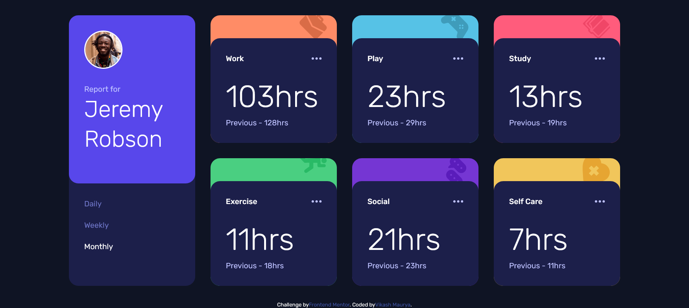
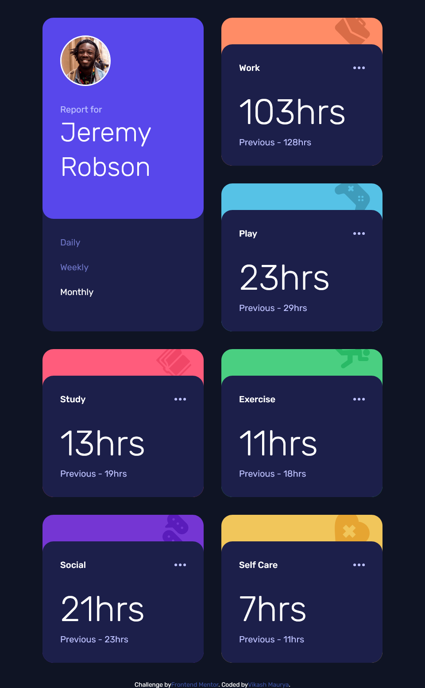
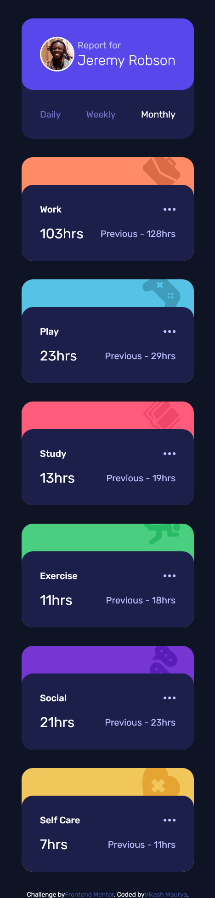

# Frontend Mentor - Time tracking dashboard solution

This is a solution to the [Time tracking dashboard challenge on Frontend Mentor](https://www.frontendmentor.io/challenges/time-tracking-dashboard-UIQ7167Jw).

## Table of contents

- [Overview](#overview)
  - [The challenge](#the-challenge)
  - [Screenshot](#screenshot)
  - [Links](#links)
- [My process](#my-process)
  - [Built with](#built-with)
  - [What I learned](#what-i-learned)
  - [Useful resources](#useful-resources)
- [Author](#author)

## Overview

### The challenge

Users should be able to:

- View the optimal layout for the site depending on their device's screen size
- See hover states for all interactive elements on the page
- Switch between viewing Daily, Weekly, and Monthly stats
- Fatch data from JSON file

### Screenshot

| Desktop preview                           | Tablet Preview                           | Mobile Preview                           |
| ----------------------------------------- | ---------------------------------------- | ---------------------------------------- |
|  |  |  |

### Links

- Solution URL: [get solution🌐](https://github.com/VikashMaurya10/time-tracking-dashboard-main)

- Live Site URL: [view🌐](https://time-tracking-dashboard-main-vm.vercel.app/daily)

## My process

### Built with

- JSX
- SCSS custom properties
- Flexbox
- CSS Grid
- Mobile-first workflow
- [React](https://reactjs.org/) - JS library
- [Vite](https://v3.vitejs.dev/guide/) - development server

### What I learned

I learned during this project that is How to pass data as props between two `JSX Components` and manipulate it.
To see how you can add code snippets, see below:

```jsx
import item from "../assets/data/data.json";
const Cards = (props) => {
  return (
    <>
      {item.map((value, index) => {
        const { title, img, bgColor, timeframes } = value;
        if (props.frame == `daily`) {
          return (
            <>
              {
                <Card
                  key={index}
                  Title={title}
                  imgSrc={img}
                  bg={bgColor}
                  current={timeframes.daily.current}
                  previous={timeframes.daily.previous}
                />
              }
            </>
          );
        } else if (props.frame == `weekly`) {
          return (
            <>
              {
                <Card
                  key={index}
                  Title={title}
                  imgSrc={img}
                  bg={bgColor}
                  current={timeframes.weekly.current}
                  previous={timeframes.weekly.previous}
                />
              }
            </>
          );
        }
      })}
    </>
  );
};
```

```jsx
const Card = ({ Title, imgSrc, bg, current, previous }) => {
  return (
    <>
      <div
        className="card"
        style={{
          backgroundImage: `url(${imgSrc})`,
          backgroundColor: `${bg}`,
        }}
      >
        <div className="inner">
          <h2>{Title}</h2>
          <h3>{current}hrs</h3>
          <p>Previous - {previous}hrs</p>
        </div>
      </div>
    </>
  );
};
```

### Useful resources

- [Figma](https://www.figma.com) - This helped me for measuring the actual design. I really liked this pattern and will use it going forward.

## Author

- website - [@vikashmaurya](https://github.com/VikashMaurya10/VikashMaurya10)
- Frontend Mentor - [@vikashmaurya](https://www.frontendmentor.io/profile/VikashMaurya10)
- LinkedIn - [@in-vikashmaurya](https://www.linkedin.com/in/in-vikashmaurya)
